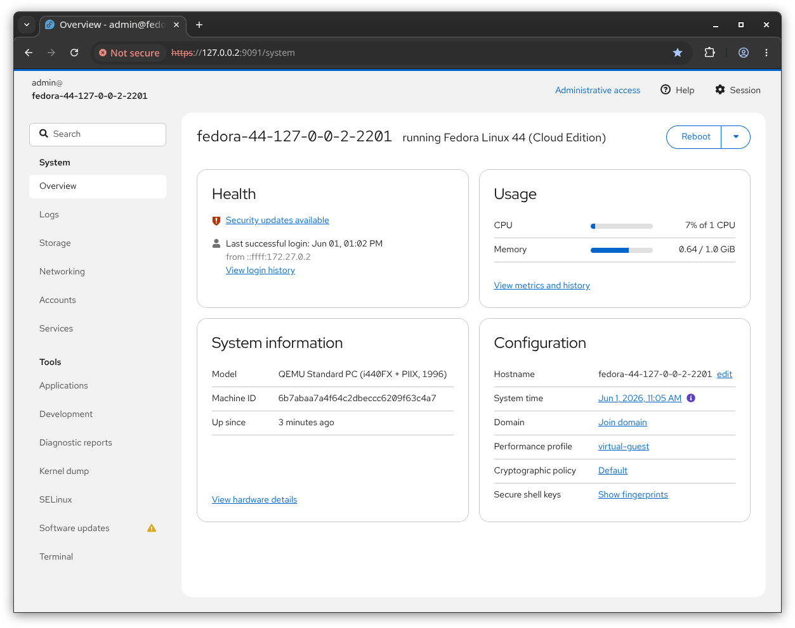
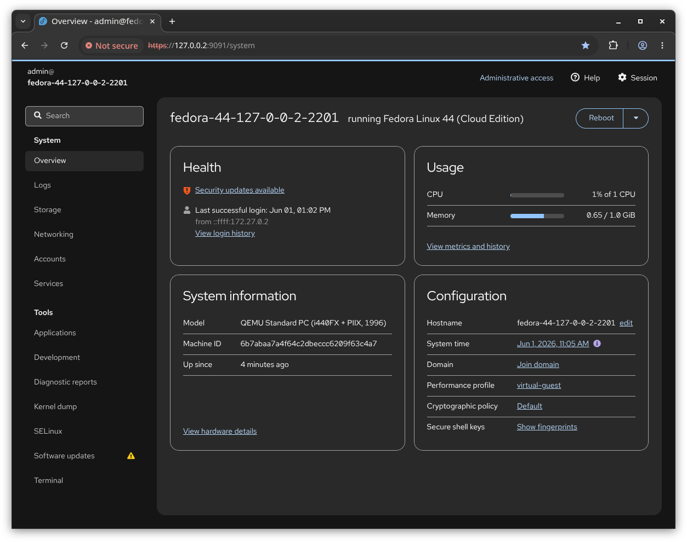
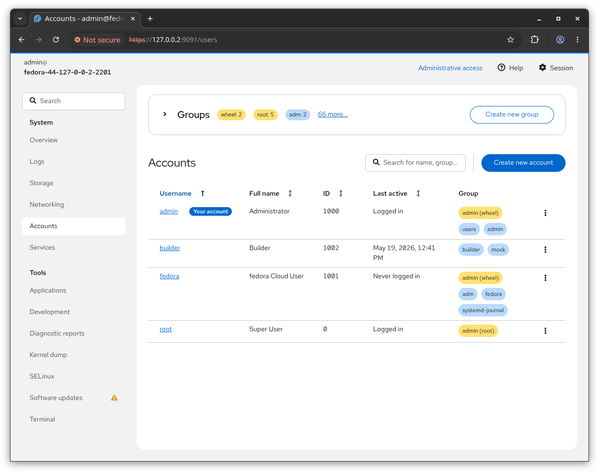
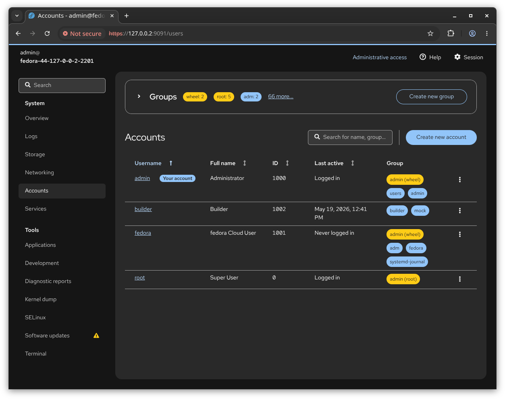
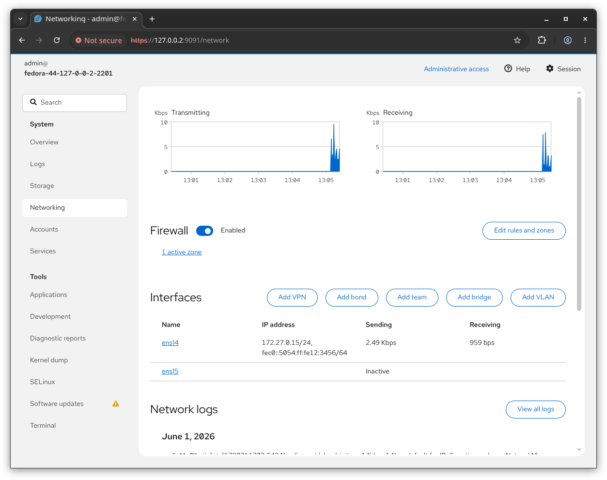
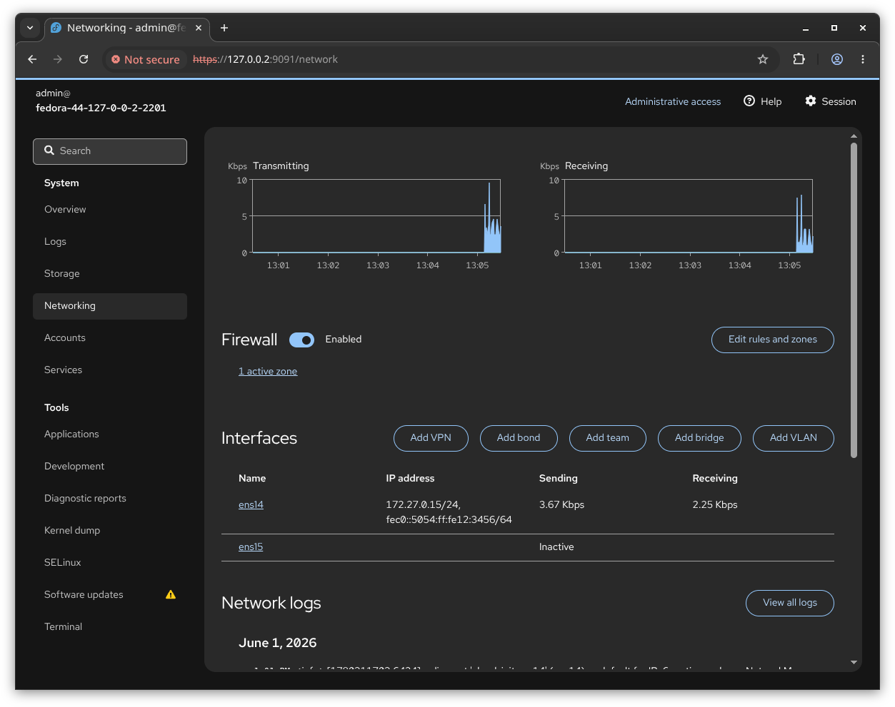

<p align="center">
    <a href="https://cockpit-project.org/">
      
    </a>
    <br>
    <i>A sysadmin login session in a web browser</i>
</p>

---

[](https://github.com/cockpit-project/cockpit/releases/latest)
[](https://flathub.org/en/apps/org.cockpit_project.CockpitClient)
[](https://repology.org/project/cockpit/versions)
[](https://translate.fedoraproject.org/projects/cockpit/cockpit/)

[](https://matrix.to/#/#cockpit:fedoraproject.org)
[](https://fosstodon.org/@Cockpit)


## What is Cockpit?

Cockpit is an interactive server admin interface. It is easy to use and very lightweight.
Cockpit interacts directly with the operating system from a real Linux session in a browser.

Cockpit makes Linux discoverable, allowing sysadmins to easily perform tasks such as starting
containers, storage administration, network configuration, inspecting logs and so on.

Jumping between the terminal and the web tool is no problem. A service started via Cockpit
can be stopped via the terminal. Likewise, if an error occurs in the terminal, it can be seen
in the Cockpit journal interface.

You can also easily add other machines that have Cockpit installed and are accessible via SSH and jump
between these hosts.

## Installation

> [!NOTE]
> An installation guide can be found at [cockpit-project.org/running.html](https://cockpit-project.org/running.html). Some systems may need extra work, read about it in our [FAQ](https://cockpit-project.org/faq.html#installation)

Cockpit is available in numerous Linux distributions and is usually served under `cockpit` package name. 

[](https://repology.org/project/cockpit/versions)

### Flatpak 'Cockpit Client'

We also provide a Flatpak app called [Cockpit Client](https://flathub.org/en/apps/org.cockpit_project.CockpitClient) which includes SSH login support to Linux servers.

```bash
flatpak install --user flathub org.cockpit_project.CockpitClient
```

## Screenshots

| Light                                                                         | Dark                                                                        |
| ----------------------------------------------------------------------------- | --------------------------------------------------------------------------- |
|   |   |
|    |    |
|  |  |

## Contributors

See [developer documentation](https://github.com/cockpit-project/cockpit/wiki/Contributing) for information about setting up local build environments, running tests, and our overall contribution process.

Translations are managed in [Weblate](https://translate.fedoraproject.org/projects/cockpit/cockpit/).

## Security

Please see [SECURITY.md](https://github.com/cockpit-project/.github/blob/main/SECURITY.md).

## Licenses

* [LGPL-2.1 or later](./LICENSES/LGPL-2.1.txt)
* [GPL-3.0 or later](./LICENSES/GPL-3.0.txt)
* [BSD-3](./LICENSES/BSD-3-Clause.txt)
* [CC-BY-SA-3.0](./LICENSES/CC-BY-SA-3.0.txt)
* [MIT](./LICENSES/MIT.txt)

## Links

 * Matrix Channel: [`#cockpit:fedoraproject.org`](https://matrix.to/#/#cockpit:fedoraproject.org)
 * [Mailing List](https://lists.fedorahosted.org/admin/lists/cockpit-devel.lists.fedorahosted.org/)
 * [Guiding Principles](https://cockpit-project.org/ideals.html)
 * [Release Notes](https://cockpit-project.org/blog/category/release.html)
 * [Privacy Policy](https://cockpit-project.org/privacy.html)
