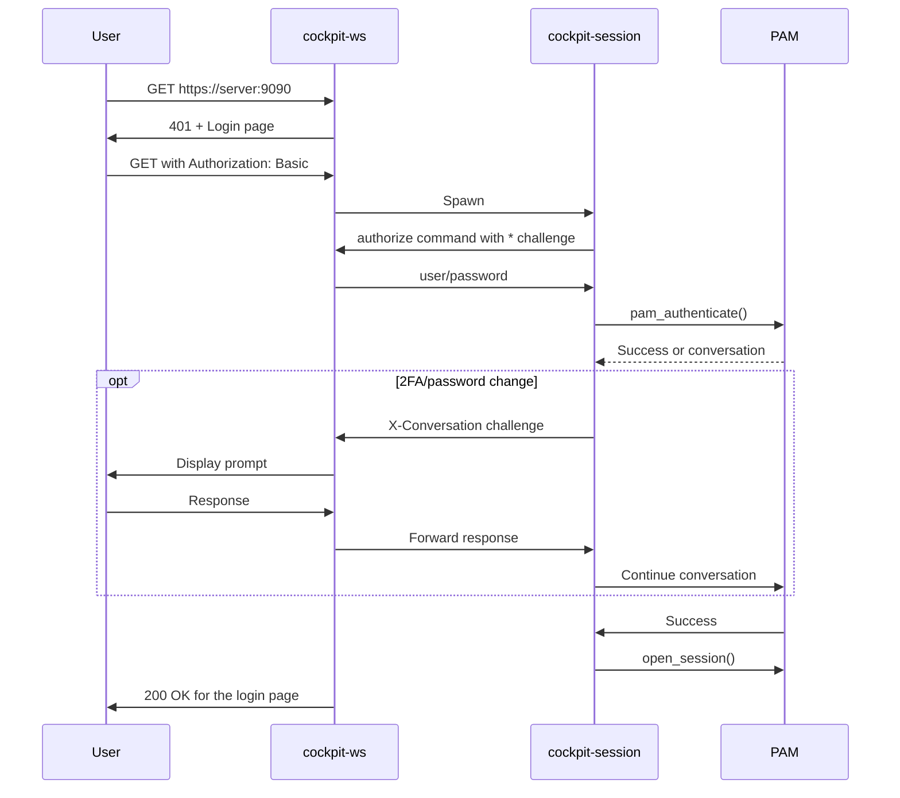

Cockpit Authentication
======================

Cockpit authorizes users by looking at the Authorization header on requests
to /login. Cockpit will attempt to perform the start the authentication command that
is configured for the auth scheme contained in the header.

To configure an auth scheme add a section to cockpit.conf for that scheme. For example
to configure an command for the "Bearer" auth scheme your cockpit.conf should contain
the following section.

```
[bearer]
command = example-verify-token
timeout = 300
```

The command is then responsible to:

 * verify the given credentials
 * setup an appropriate session and environment based on those credentials
 * launch a bridge that speaks the cockpit protocol on stdin and stdout.

The default command is `cockpit-session` it is able to handle Password
(`[basic]`), Kerberos/GSSAPI (`[negotiate]`), and TLS client certificate
(`[tls-cert]`) authentication.

Authentication commands are called with a single argument which is the host that the user
is connecting to. They communicate with their parent process using the cockpit protocol on
stdin and stdout.

Instead of `Command`, it's also possible to specify `UnixPath` to connect to a unix socket at a
given path.  The protocol is the same.

Credentials can then be retrieved by issuing a authorize command with a challenge. The challenge
should correspond to the authorization type in header (ei: Basic or Bearer). For example:


```
{
    "command": "authorize",
    "cookie": "cookie",
    "challenge": "*"
}
```

The response will look something like this

```
{
    "command": "authorize",
    "cookie": "cookie",
    "response": "Basic dXNlcjpwYXNzd29yZAo=",
    "remote-peer": "1.2.3.4",
}
```

`remote-peer` is the IP address of the connecting user, if known (otherwise
unset).

A `*` challenge requests whatever credentials the parent process has. Most auth
commands will want to begin by issuing a `*` challenge.

By default cockpit-ws will wait a maximum of 30 seconds to receive this response.
The number of seconds to wait can be adjusted by adding a timeout parameter along
side the auth schema configuration in your config file. The given value should be
a number between 1 and 900.

If more information is needed the command should respond with a `X-Conversation` challenge.
This takes the following format.

```
X-Conversation nonce base64(prompt message)
```

The message will be displayed to the user and the user will be prompted for a response.
If the user does not respond within 60 seconds the command will be closed and the login
aborted. The number of seconds to wait can be adjusted by adding a response-timeout parameter
along side the auth schema configuration in your config file. The given value should be a
number between 1 and 900.

Once a result is known a "init" command should be sent. If the login was successful you can usually
just let the bridge do this.

If the login was not successful the JSON should include a problem field. Values of
`authentication-failed`, `authentication-unavailable` or `access-denied`
are translated to the appropriate cockpit error codes. Any other values are treated
as generic errors. Additionally a message field may be included as well.

If an process exits without sending a init command, that will be treated as an internal error.

If the authentication command has additional data that it would like to return with a successful response
it can do so by sending a `x-login-data` challenge. The command should have an additional JSON field
`login-data`. The string placed there will be returned by along with a successful json response.

For a simple python example see
[cockpit-auth-ssh-key](https://github.com/cockpit-project/cockpit/blob/main/containers/ws/cockpit-auth-ssh-key).

Remote machines
---------------

Cockpit also supports logging directly into remote machines. The remote machine to
connect to is provided by using a application name that begins with `cockpit+=`.
The default command used for this is `python3 -m cockpit.beiboot`, which
invokes `ssh`.

The section `Ssh-Login` defines the options for all ssh commands. The section
has the same options as the other authentication sections with the following additions.

 * `host` The default host to log into. Defaults to 127.0.0.1. That host's key
   will not be checked/validated.
 * `connectToUnknownHosts`. By default cockpit will refuse to connect to any machines that
   are not already present in ssh's global `known_hosts` file (usually
   `/etc/ssh/ssh_known_hosts`). Set this to `true` is to allow those connections
   to proceed.

After the user authentication with the `"*"` challenge, if the remote
host is not already present in any local `known_hosts` file, this will send an
`"x-host-key"` challenge:

```
{
    "command": "authorize",
    "challenge": "x-host-key"
    "cookie": "cookie",
}
```

The caller responds to that with either a valid key like below, or an empty
string response if there is no available key.

```
{
    "command": "authorize",
    "cookie": "cookie",
    "response": "ssh-rsa AAAA1234...",
}
```

Client certificate authentication
---------------------------------
When a machine is joined to an Identity Management domain (like
[FreeIPA](https://www.freeipa.org) or Active Directory) which has [client-side
user certificates](https://www.freeipa.org/page/V4/User_Certificates) set up,
then these can be enabled for authentication to Cockpit by setting this option
in cockpit.conf:

```
[WebService]
ClientCertAuthentication = yes
```

This uses the `[tls-cert]` authentication scheme.

When enabling this mode, other authentication types commonly get disabled. See
the next section for details.

See the [Certificate/smart card authentication guide](https://cockpit-project.org/guide/latest/cert-authentication.html)
for details how to set this up.

Actions
-------

Setting an action can modify the behavior for an auth scheme. Currently two actions
are supported.

 * **remote-login-ssh** Use the `Ssh-Login` section instead.
 * **none** Disable this auth scheme.

To configure an action add the `action` option. For example to disable basic authentication,
cockpit.conf should contain the following section:

```
[basic]
action = none
```

Likewise, if the machine is part of a Kerberos domain, but that should not be used to
authenticate to cockpit, create the following section:

```
[negotiate]
action = none
```

Limits
------

Cockpit can be configured to limit the number of concurrent login processes. See cockpit.conf
for more details. This will affect how many custom authentication processes can be launched.

Environment Variables
---------------------

The following environment variables are set by cockpit-ws when spawning an auth process for
SSH connections:

 * **COCKPIT_SSH_CONNECT_TO_UNKNOWN_HOSTS** Set to `1` to  allow connecting to
   hosts that are not present in the current `known_hosts` files. If not set,
   Cockpit will only connect to unknown hosts if either the remote peer is
   local, or if the `Ssh-Login` section in `cockpit.conf` has an
   `connectToUnknownHosts` option set to a true value (`1`, `yes` or `true`).

 * **COCKPIT_SSH_KNOWN_HOSTS_FILE** Path to knownhost files. Defaults to
   `PACKAGE_SYSCONF_DIR/ssh/ssh_known_hosts`

Login process: User/Password
----------------------------

This section entirely ignores cockpit-tls for simplicity, as it is not involved in the authentication. See [cockpit-tls docs](../src/tls/README.md) for details.

 1. _User_ connects to cockpit URL.
 2. _cockpit-ws_ responds with "401 Authentication failed" and sends the Login page, unless when Kerberos is available (see below) or the server is configured to not use any authentication.
 3. _User_ fills in username/password and clicks "Log In". The login page sends a new request to _cockpit-ws_ with an `Authorization: Basic base64(user:password)` header
 4. _cockpit-ws_ looks at `cockpit.conf` whether it has a customized session `Command` or `UnixPath` for `basic`. If not, defaults to `cockpit-session` (via `UnixPath = /run/cockpit/session`). It parses user/password from the header and spawns the session command with the target host as argument.
 5. _cockpit-session_ sends an `authorize` command with a `*` challenge (see above) to _cockpit-ws_, which responds with the user/password
 6. _cockpit-session_ starts a _PAM_ session for the user, and sets the initial credential to the received password
 7. If _PAM_ sends more messages, like e.g. 2FA prompts or changing expired passwords:
    * _cockpit-session_ sends corresponding `X-Conversation` authorize messages (see above) to _cockpit-ws_
    * _cockpit-ws_ forwards them to the Login page, which displays the text, and sends the user response as the authorize reply
    * _cockpit-ws_ forwards the authorize reply to PAM
 8. When PAM succeeds, _cockpit-session_ executes the bridge and the session starts.



Login process: Kerberos/GSSAPI
-------------------------------

 1. _User_ connects to cockpit URL.
 2. _cockpit-ws_ responds with "401 Authentication failed" and includes `WWW-Authenticate: Negotiate` header (if Kerberos is available)
 3. _Browser_ (if configured for SPNEGO/Kerberos) requests a service ticket from the _KDC_ for the HTTP service principal
 4. _Browser_ sends a new request with `Authorization: Negotiate <base64-gssapi-token>` header
 5. _cockpit-ws_ looks at `cockpit.conf` whether it has a customized session command for `negotiate`. If not, defaults to `cockpit-session` and runs it in the same way as above.
 6. _cockpit-session_ calls `gss_accept_sec_context()` with the GSSAPI token to verify the Kerberos ticket
 7. If GSSAPI returns `GSS_S_CONTINUE_NEEDED` (multi-round negotiation):
    * _cockpit-session_ sends an authorize command with a `Negotiate` challenge containing the output token to _cockpit-ws_
    * _cockpit-ws_ responds with "401 Authentication failed" and `WWW-Authenticate: Negotiate <token>` to the _Browser_
    * _Browser_ sends another `Authorization: Negotiate <token>` request
    * This continues until GSSAPI negotiation completes
 8. When GSSAPI succeeds, _cockpit-session_ has the authenticated GSSAPI principal name
 9. _cockpit-session_ maps the GSSAPI name to a local username using `gss_localname()` (which applies configured mapping rules), or if that fails, falls back to `gss_display_name()` which returns the principal name as-is (e.g. `user@REALM.COM`)
 10. _cockpit-session_ starts _PAM_, skipping the auth stack (as GSSAPI already authenticated), and runs the account, credential, and session stacks
 11. _cockpit-session_ stores the delegated Kerberos credentials (if delegation was negotiated) in a credential cache at `/run/user/<uid>/cockpit-session-<pid>.ccache` and sets `KRB5CCNAME` in the PAM environment, so that the bridge can use them for accessing other Kerberos-protected services (like SSH to remote machines)
 12. Authentication completes, and the session starts as above.

Login process: Client Certificate
----------------------------------

Unlike the other sections, this one involves _cockpit-tls_ as well as it provides a crucial part of the authentication.

 1. _User_ connects to cockpit URL with a client certificate, which lands at _cockpit-tls_
 2. _cockpit-tls_ calculates the SHA256(certificate) as the user fingerprint
 3. _cockpit-tls_ connects to the `cockpit-wsinstance-https@<fingerprint>` systemd socket/service (starting a dedicated _cockpit-ws_ instance for this certificate if needed). See [cockpit-tls docs](../src/tls/README.md) and [systemd units](../src/systemd/) for details.
 4. _cockpit-tls_ exports the certificate to `/run/cockpit/tls/clients/<fingerprint>` (kept as long as there is at least one active connection with that certificate)
 5. _cockpit-tls_ includes `"client-certificate": "<fingerprint>"` in its mini JSON protocol to _cockpit-ws_
 6. _cockpit-ws_ detects the client certificate metadata and uses `tls-cert <fingerprint>` as the authorization type
 7. _cockpit-ws_ looks at `cockpit.conf` whether it has a customized session command for `tls-cert`. If not, defaults to `cockpit-session` and runs it in the same way as above.
 8. _cockpit-session_ receives the `tls-cert <fingerprint>` authorization and reads the certificate from `/run/cockpit/tls/clients/<fingerprint>`
 9. _cockpit-session_ validates that the certificate file exists and matches the expected _cockpit-ws_ cgroup
 10. _cockpit-session_ calls the _sssd_ D-Bus API (`org.freedesktop.sssd.infopipe.Users.FindByCertificate`) to map the certificate to a username
 11. When successful, _cockpit-session_ sets the username and starts _PAM_, skipping the auth stack (as the certificate itself was the authentication), and runs the account, credential, and session stacks
 13. Authentication completes, and the session starts as above.

Login process: SSH to remote machine
------------------------------------

 1. _User_ connects to a URL like `https://server:9090/=hostname`) or sets the "Connect to:" field in the Login page to `hostname`.
 2. _login.js_ sends the login HTTP request with `Authorization: Basic base64(user:password\0known_hosts)` header, where `known_hosts` contains any previously-stored SSH host keys for the target host from the browser's `localStorage`
 3. _cockpit-ws_ extracts the target host from the URL. As it has a host name, it looks at `cockpit.conf` for the `[Ssh-Login]` section's `Command` or `UnixPath`. If not customized, defaults to `cockpit.beiboot`
 4. _cockpit-ws_ spawns the ssh command with the target host as argument
 5. _cockpit.beiboot_ sends an `authorize` command with a `*` challenge to _cockpit-ws_, which responds with the user/password/known_hosts from the `Authorization` header (same as User/Password step 5)
 6. _cockpit.beiboot_ parses the credentials, writes any received `known_hosts` to a temporary file, and configures `ssh` to use it via `-o UserKnownHostsfile=...`
 7. _cockpit.beiboot_ connects to the remote host via SSH using the [ferny API](https://github.com/allisonkarlitskaya/ferny/).
 8. If the remote host's SSH key is unknown or has changed:
    * For **unknown** hosts: SSH prompts via its `SSH_ASKPASS` mechanism. _ferny_'s interaction agent detects the host key prompt, parses the fingerprint, and _cockpit.beiboot_ sends an `X-Conversation` challenge to _cockpit-ws_ with the host key fingerprint and hostname.
    * For **changed** keys: SSH immediately fails with a changed host key error. _ferny_ detects this as `SshChangedHostKeyError`. _cockpit.beiboot_ fails with `problem=invalid-hostkey`. _login.js_ catches this and retries the login **without** sending the old known_hosts entry, causing SSH to treat it as an unknown host (see above).
    * For localhost (127.0.0.1): _cockpit.beiboot_ automatically accepts the key without user interaction.
    * _cockpit-ws_ forwards the `X-Conversation` challenge to the web UI
    * _login.js_ shows a host key verification dialog with the fingerprint, key type, and hostname to the user; it remembers unknown vs. changed and shows appropriate UI
    * User accepts or rejects the key
    * _login.js_ sends the response back via `X-Conversation` header
    * _cockpit.beiboot_ returns the response to SSH's askpass mechanism
    * SSH proceeds with the connection (if accepted) or fails (if rejected)
 9. If SSH prompts for additional input (like 2FA): Similar to step 7 in User/Password section: _cockpit.beiboot_ sends `X-Conversation` messages back and forth
 10. When SSH authentication succeeds, _cockpit.beiboot_ either runs an existing remote `cockpit-bridge`, or sends its own Python module through the SSH connection (via [beipack](https://github.com/allisonkarlitskaya/beipack)). It starts bridge on the remote machine and connects its stdio to it
 11. Authentication completes, and the session starts as above.
 12. After successful SSH authentication and bridge startup, if a new host key was accepted, _cockpit.beiboot_ reads the updated `known_hosts` file and sends it to the browser in the `init` message's `login-data` field as `known-hosts`
 13. _login.js_ stores the received `known-hosts` entry in localStorage for future connections to this host
