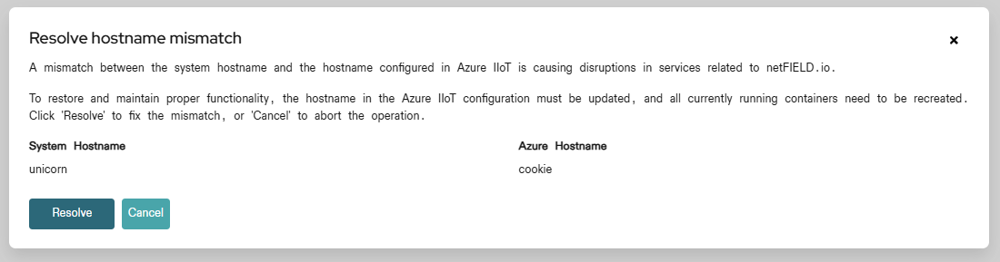
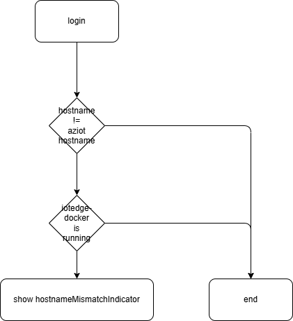
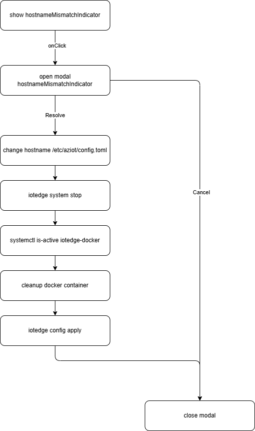

# sensorEDGE development

## Hostname mismatch indicator




The "edge monitor container" which runs in host mode, need for some of its services to read the current "hostname" of the host it is running on. 

But if the user has changed the hostname in the "System/Hostname" dialog, no changes are made in the /etc/aziot/config.toml file accordingly. In turn the azureiot-edge service which the edge monitor container is using is still reading the "old" hostname from the file and tries to work with a wrong hostname. In this case some services fail to work

Also if you look into details the iotedge service give a hint to the user how to proceed after it recognizes the hostname has been changed:

```
Cannot apply config because the hostname in the config "xxxxxnewhostname" is different from the previous hostname "yyyyyyyoldhostname". To update the hostname, run the following command which deletes all modules and reapplies the configuration. Or, revert the hostname change in the config.toml file.

sudo iotedge system stop && sudo docker-iotedge rm -f $(docker-iotedge ps -aq) && sudo iotedge config apply

Warning: Data stored in the modules is lost when above command is executed.
```


## show hostname mismatch indicator




## show hostname mismatch indicator modal


