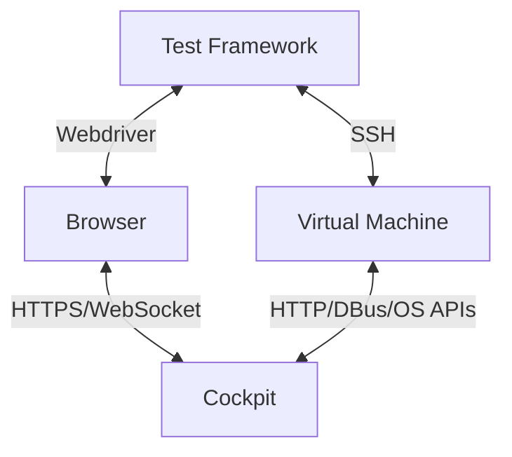
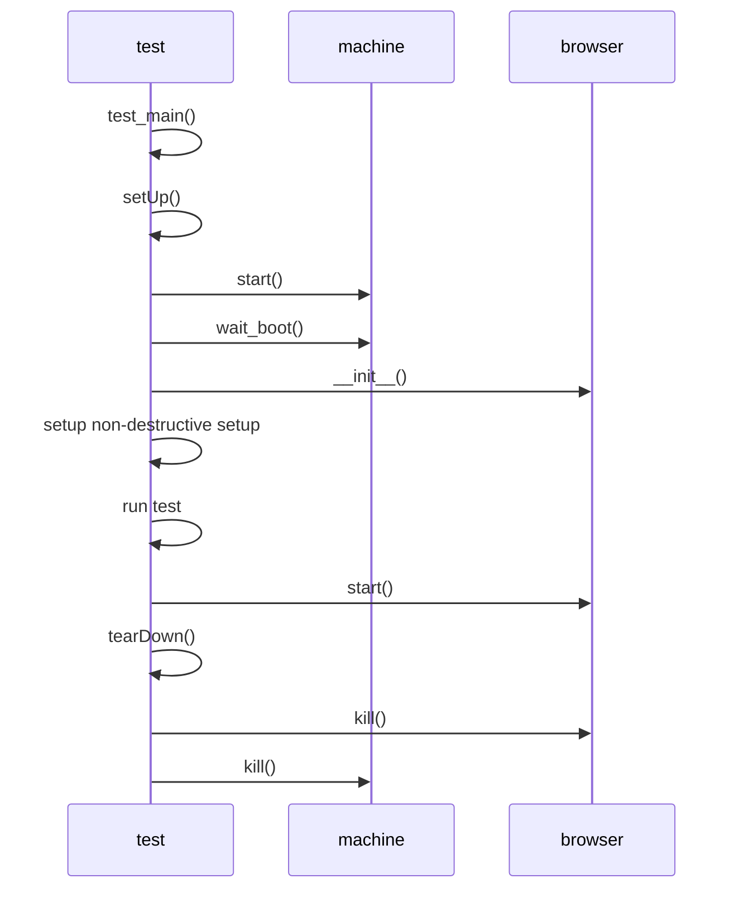
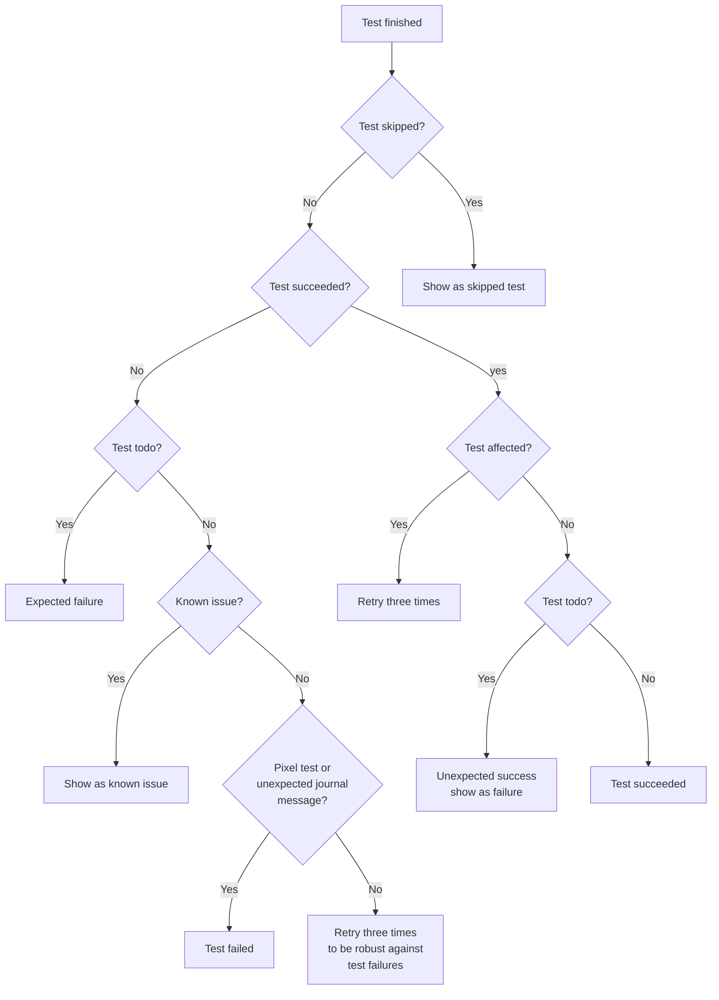

# Architecture

This document describes the architecture of Cockpit's browser integration
tests. The tests should automate how a normal user interacts with Cockpit.
This requires a test machine which can add multiple disks or interfaces,
reboot, interact with multiple machines on the same network and run potentially
"destructive" test scenarios (e.g. installing/updating packages, formatting
disks).

For these reasons, Cockpit tests run inside a virtual machine (VM). The virtual
machine uses Cockpit specific virtual machine images maintained and created in
the [bots](https://github.com/cockpit-project/bots) repository. The images are
usually based on a distribution's cloud image customized with:

* A well-known password and SSH key for the admin and root users
* Packages required to test Cockpit
* A build chroot with Cockpit's build dependencies to build the to be tested
  Cockpit source inside the virtual machine offline. This allows a developer on
  Fedora to easily prepare a Debian test image without having to install Debian
  build tools.
* Disabling system services which interfere with testing

To automate user actions on the web page, Cockpit is tested in a browser
controlled using the [Webdriver BiDi](https://w3c.github.io/webdriver-bidi/)
protocol which is supported by all modern browsers.

The Python test framework in [test/common](./common) is responsible for setting up the
test environment, running tests and reporting of the test output.

Diagram of the interaction of Browser/Machine/Webdriver/Test Framework.


## Integration Tests

Cockpit's tests can be run via three different entry points:

* `test/verify/check-$page` - run a single or multiple test(s)
* `test/common/run-tests` - run tests through our test scheduler (retries, tracks naughties, parallelism)
* `test/run` or `.cockpit-ci/run` - CI entry point

We will start with how a single integration test is run and then explore the test
scheduler and CI setup.

### Test runtime

The base of a Cockpit integration test looks as following:

```python
class TestSystem(testlib.MachineCase):
    def testBasic(self):
        self.login_and_go("/system")
        self.machine.execute("echo 'test' > /etc/motd")
        self.browser.wait_text("#motd", 'test')

if __name__ == '__main__':
    testlib.test_main()
```

In Cockpit there are two types of tests, "destructive" and "non-destructive"
tests. Destructive tests do something to the virtual machine which makes it
unable to run another test afterwards or requires another virtual machine for
testing. The test above is a "destructive" test which is the default, a non
"destructive" test makes sure any destructive action is restored after the test
has run as can be seen below. "Non-destructive" tests were introduced to be able
to run them on a single running machine, such as the Testing Farm or a custom VM.
They also speed up testing, as booting a machine for every tests incurs a
significant penalty of ~ 10-30 seconds per test.

```python
@testlib.nondestructive
class TestSystem(testlib.MachineCase):
    def testBasic(self):
        self.login_and_go("/system")
        self.write_file("/etc/motd", "test")
        self.browser.wait_text("#motd", 'test')

if __name__ == '__main__':
    testlib.test_main()
```

The test above would be invoked via `./test/verify/check-apps TestSystem.testBasic`
and would execute as can be seen in the diagram below:


A test starts by calling `test_main`, this provides common command line
arguments for debugging and to optionally run a test on a different
machine/browser. These arguments are available in the `MachineCase` class as
`opts`. `test_main` also takes care of instantiating a `TapRunner` which runs
all the specified tests sequentially.

Once a test is started it runs `MachineCase.setUp` which has the responsibility
to start a virtual machine(s) depending on if it is a "non-destructive" or
"destructive" test. If we run a "non-destructive" test a global machine is
created, and re-used for other "non-destructive" tests which might run. For
"destructive" tests a machine is created on-demand, possible multiple machines
depending on the test class `provision` variable.

 For "non-destructive" tests cleanup handlers are installed to restore files in
 `/etc`, cleans up home directories etc.

 Lastly a `Browser` class is instantiated, this does not start the Browser
 directly but builds the required command for the `TEST_BROWSER` to start
 either Chromium or Firefox. When a test calls any method on the browser object
 the browser will be started, so tests which require no browser don't start a
 browser needlessly.

The `WebdriverBidi` class is responsible for spawning the browser and talking
to it using the [Webdriver BiDi](https://w3c.github.io/webdriver-bidi/)
protocol (which we implement directly for ourselves, using aiohttp).

On `tearDown` the test status is inspected, if it failed test logs are
collected and if the user has passed `--sit` the test pauses execution until
the user presses enter so that the machine/browser state can be inspected. The
test browser is killed after the `tearDown` function completed.

Virtual machines are killed by the `TapRunner` once all tests have finished or
in `setUp` if it's a "destructive" test as "non-destructive" tests re-use the
existing global machine.

### Test runner

Cockpit uses a custom test runner to run the tests, spread the load over jobs
and special handling of test failures. The test runner is implemented in Python
in [test/common/run-tests](./common/run-tests) and expects a list of tests to
be provided.

The provided tests are collected and split up in "destructive" and
"non-destructive" tests, every test is given a "cost" depending on the amount
of virtual machines required to run the test for scheduling priority. A default
timeout is added to every test so hanging tests get killed over time, tests
which take longer can set a custom timeout using a test decorator.

To make sure our tests aren't flaky we retry tests three times when they are
affected. An affected test is for example `test/verify/check-apps` if
`pkg/apps` is changed, or if the changeset changes less then four tests they
will be marked as affected as well. The changed tests are limited so big
refactors won't retry a lot of tests.

Having collected the "destructive", "non-destructive" and affected tests a
scheduling loop is started, if a machine was provided it is used for the
"non-destructive" tests, "destructive" tests will always spawn a new machine. If no
machine is provided a pool of global machines is created based on the provided
`--jobs` and "non-destructive" tests. The test runner will first try to assign all
"non-destructive" tests on the available global machines and start the tests. 

The scheduling loop periodically inspects all running tests and polls if the
test has ended. Depending on the exit code of the test process the test runner
makes a decision on what to do next as described in the diagram below.


* `Skipped` -  tests can be skipped because the test can not run on the given `TEST_OS`.
* `Affected` - tests to be retried to make sure any changes affecting them do not lead to flaky tests.
* `Todo` - tests which are incomplete and expected to fail.
* `Known issue` - Naughties are expected test failures due to known issues in software we test,
                  we still run the test but if the test error output matches a known naughty it
                  is skipped. The [bots](https://github.com/cockpit-project/bots) repository keeps track
                  of all our known naughties per distro. (The bots repository has automation
                  setup to see if a naughty is still affected and if not open a pull request to
                   drop it).
* `Failed` - tests can fail due to our test shared infrastructure, instead of
             letting the whole test run fail, we re-try them unless `--no-retry-fail` is
             passed.

### Continuous Integration (CI)

In CI we have two entry points, one for our tests which runs on our own
managed infrastructure by [cockpituous](https://github.com/cockpit-project/cockpituous/)
and one for tests which run on the [testing farm (TF)](https://docs.testing-farm.io/).

For our own managed infrastructure the entry point of the Cockpit tests is
`test/run`, or alternatively `.cockpit-ci/run`. This bash script expects a
`TEST_OS` environment variable to be set to determine what distribution to run
the tests under, and a `TEST_SCENARIO` environment variable to determine the
type of test. A list of currently supported scenarios can be found in
[test/run](./run).

Cockpit's tests are split up in scenarios to heavily parallelize our testing and
allow for faster retrying.

[test/run](./run) prepares an Virtual machine image for the given `TEST_OS` and then
runs the tests by calling `test/common/run-tests` with the provided tests.

The [tmt](https://tmt.readthedocs.io) test is defined in [test/browser/main.fmf](./browser/main.fmf). These
run on the Testing Farm (TF), triggered by [Packit](https://packit.dev/) for upstream PRs. On TF we
get a single virtual machine without a hypervisor so tests run on the virtual
machine directly. This also implies that only "non-destructive" tests can be run.
The `test/browser/browser.sh` script sets up the virtual machine and calls
`test/browser/run-tests.sh` which selects a subset of all the "non-destructive"
tests to run using `test/common/run-tests`.

The tmt test is also split up into three plans (basic, networking, optional) to
run faster in parallel.
